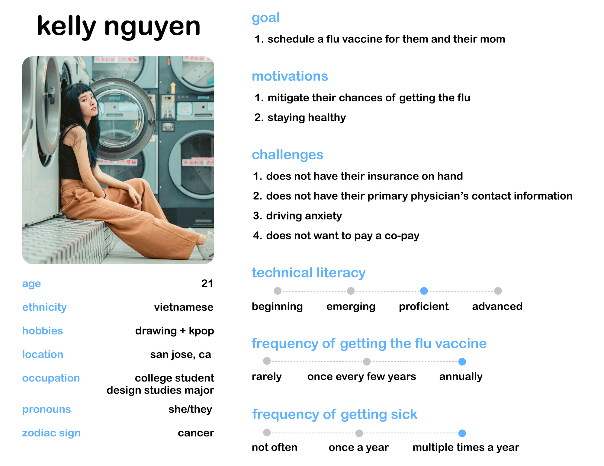
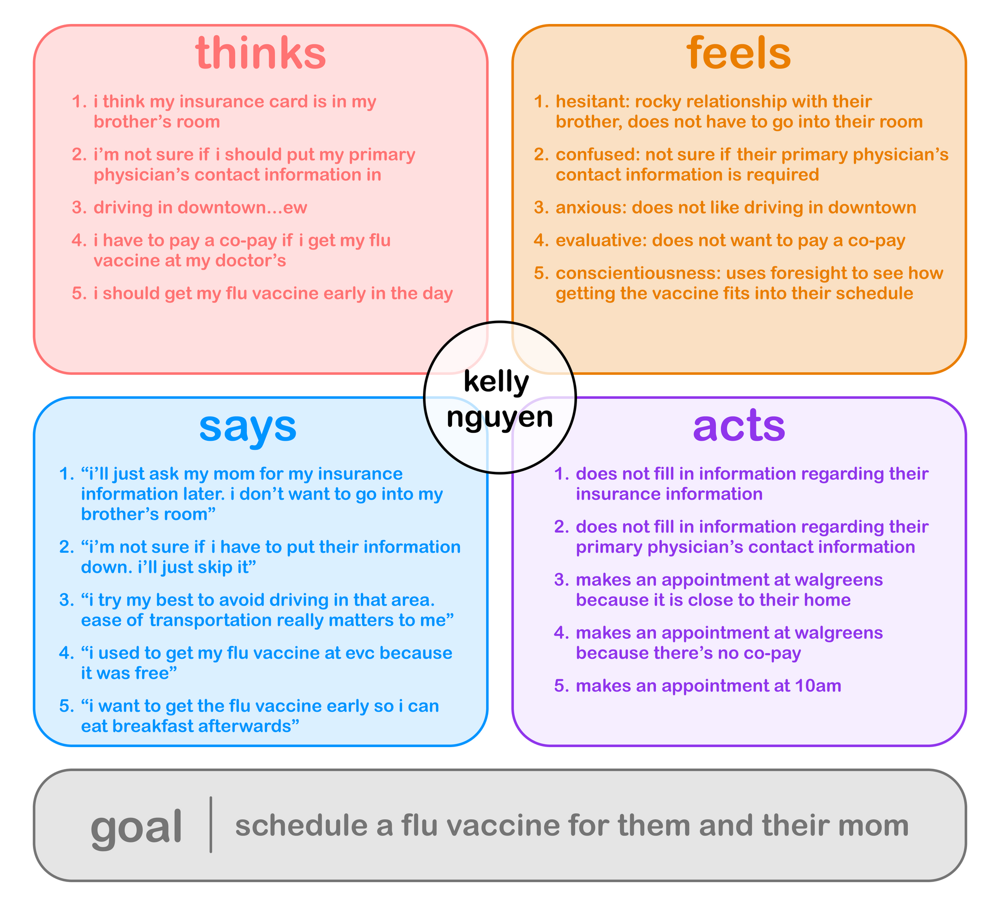
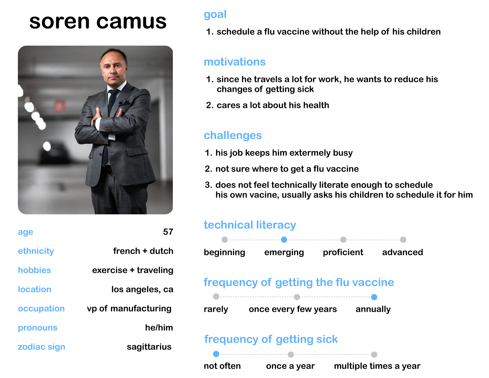
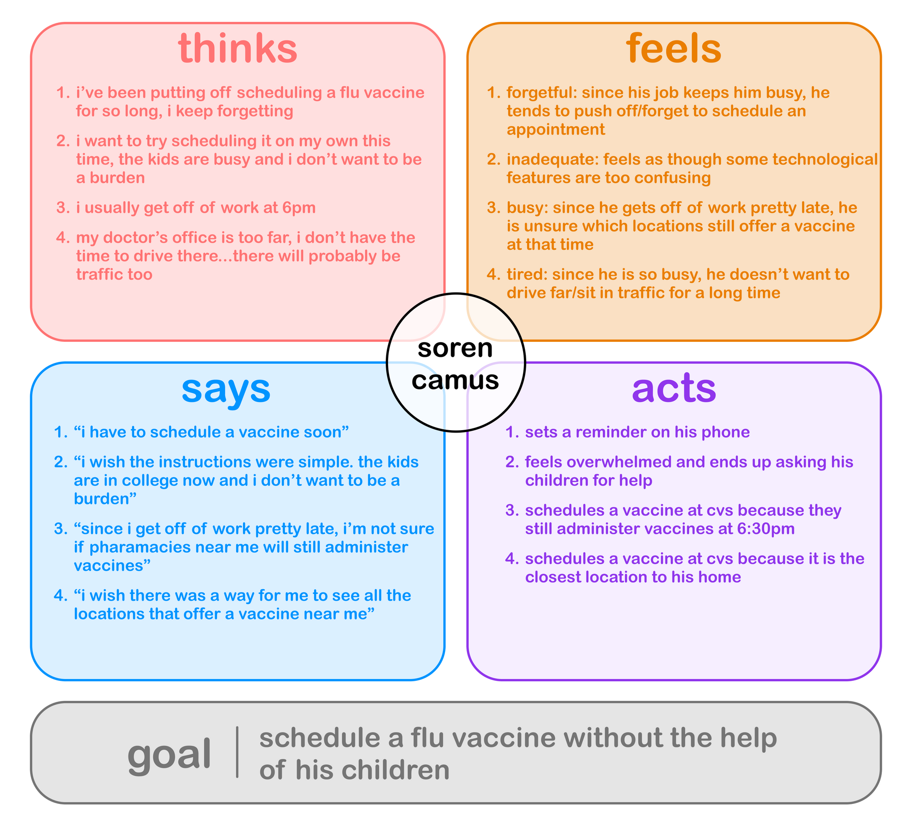
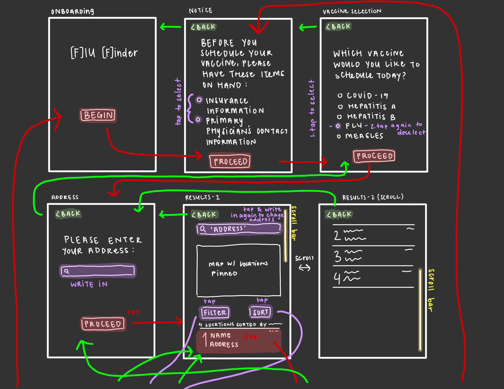
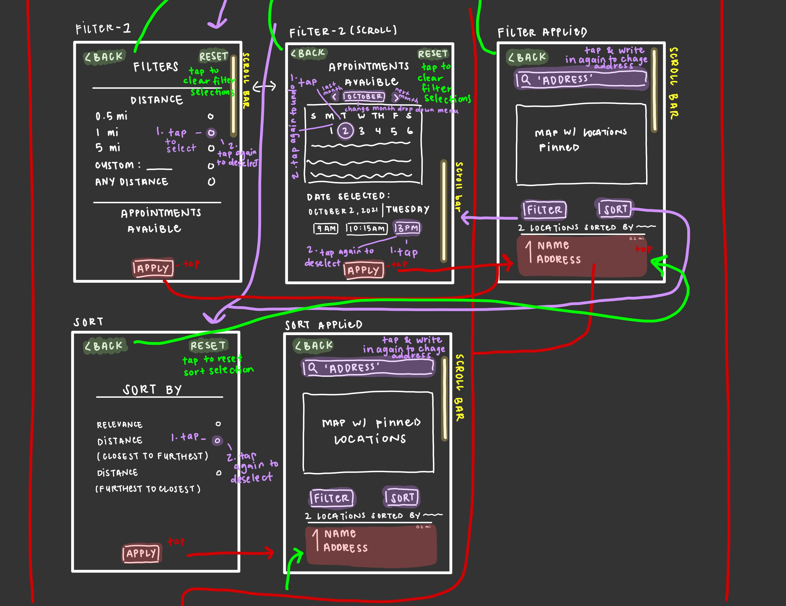
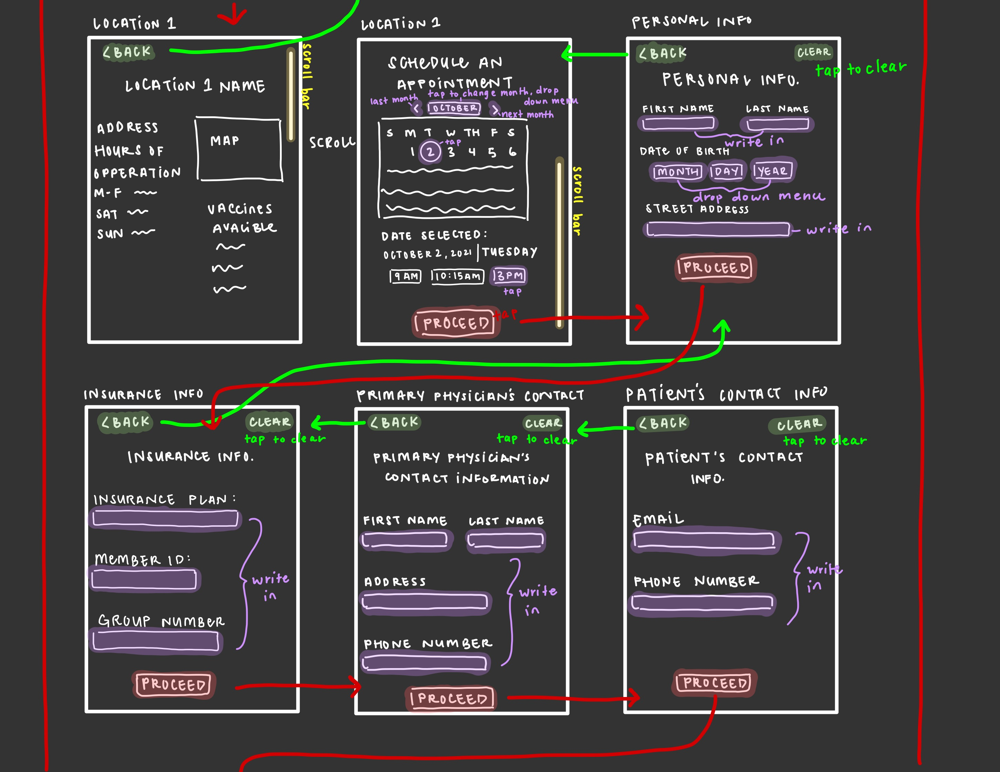
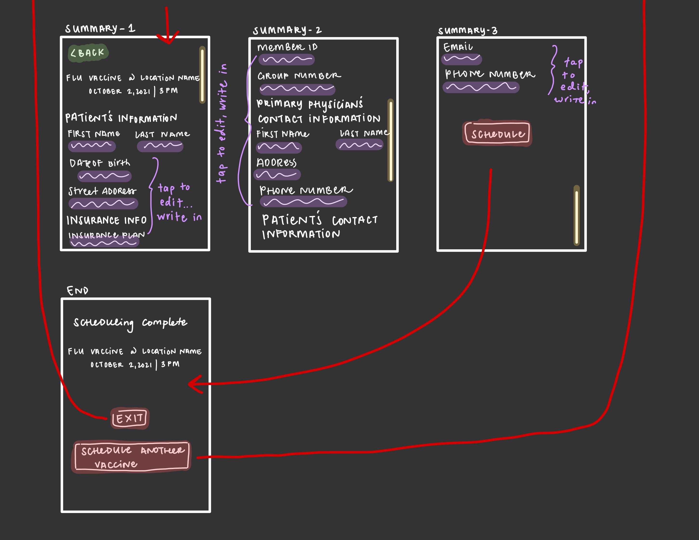

# [F]lu [F]inder
## Yvonne Nguyen | UX Design | UCLA Fall '21

### Introduction
The CDC recommends that anyone over the age of 6 months should get the flu vaccine annually as a preventative measure when flu seasons come about. Due to how frequently one should get this vaccine, there should be an efficient way for one to find and schedule a vaccine appointment. [F]lu [F]inder assists users in finding a location that offers the vaccine(s) of their choice and helps users schedule their vaccine. 

### Clear Design Statement 
When an individual wants to schedule a vaccination appointment, they typically call their doctor's office or go to a chain pharmacy. Given this, it could be difficult for one to choose which vaccination site is best suited for one's specific needs (e.g., particular type of vaccine and/or hours of opperations). [F]lu [F]inder allows users to schedule the vaccine(s) of their choice through comparing multiple chain pharmacies in order to find out which pharmacy best suits their needs.

### Competitor Analysis 
For this project, I was tasked to analyze Oregon's government websites. One of the websites I conducted my usability heuristic review on is [Oregon's Healthy Authority website](https://www.oregon.gov/oha/Pages/index.aspx). This website consists of a wide variety of health related information pretaining to Oregon's legistative measures. After conducting my usability heuristic analysis, the three usability heuristics that stood out to me as possessing the most severe usability issues:
1. consistency and standards
2. visibility of system status
3. match between system and real world.

As a precursor, this project was executed during flu season and the COVID-19 pandemic. Given this, I found it extremely bothersome when a government website that is responsible for relying important health information only offers *one* option for their constituents to find/schedule a flu vaccine: “call 211”. This option is not viable for everyone. Hence, there should be a quick and efficient way for one to find/schedule a flu vaccine without having a call a number. 

More information about my usability heuristic review can be found [here](https://github.com/yvonne-nguyen/dh110/blob/main/assignments/assignment-1.md).

More information about my usabulity testing can be found [here](https://github.com/yvonne-nguyen/dh110/blob/main/assignments/assignment-2.md). 

### User Research 
Because I worked on this project during flu season, a friend of mine was gracious enough to let me observe how they schedule their flu vaccine and spared some of their time to answer my contextual inquiry questions. These are my key takeaways from the interview:
#### 1. Location Matters
My participant prefers that the vaccination site is (1) nearby and (2) easy to drive to. Although their university offers free flu vaccinations, because the majority of their classes are online, and because their school is located in Downtown San Jose (my participant feels uneasy driving in that area), they are not getting their flu vaccine there. 

#### 2. Copy
My participant chooses to get their flu vaccine at Walgreens instead of their primary physician's office because they do not have to pay a copay at Walgreens.

#### 3. Convinence 
My participant prefers scheduling their flu appointment digitally because they have the option to see which dates and times are avaliable.

#### 4. Insurance and Primary Physician's Information
My participant did not have their insurance and primary physician's information on-hand. Hence, the application took longer than they expected. Additionally, the application had unclear instructions and they were unsure if that information is mandatory or not.

More information about my user research can be found [here](https://github.com/yvonne-nguyen/dh110/blob/main/assignments/assignment-3.md).

### UX Storytelling 
I created two user personas: Kelly and Soren. 
Kelly's User Persona

Kelly's Empathy Map

Soren's User Persona

Soren's Empathy Map

More information about my ux storytelling can be found [here](https://github.com/yvonne-nguyen/dh110/blob/main/assignments/assignment-4.md).

### Wireframe and Graphic Design Variation 
Here are my wireframe and wireflow sketches:

Here is my initial graphic design variation:

More information about my wireframes and wireflows can be found [here](https://github.com/yvonne-nguyen/dh110/blob/main/assignments/assignment-5.md).

More information about my graphic design variations can be found [here](https://github.com/yvonne-nguyen/dh110/blob/main/assignments/assignment-6.md).

### Low-fidelity Prototype 

<iframe style="border: 1px solid rgba(0, 0, 0, 0.1);" width="800" height="450" src="https://www.figma.com/embed?embed_host=share&url=https%3A%2F%2Fwww.figma.com%2Ffile%2FEkkyhsjrsY9pp6xjSA3D2a%2Fdh-110%3Fnode-id%3D0%253A1" allowfullscreen></iframe> 

### High-fidelity Prototype 

### Optional Evaluation and Revision History

### Pitch Video

